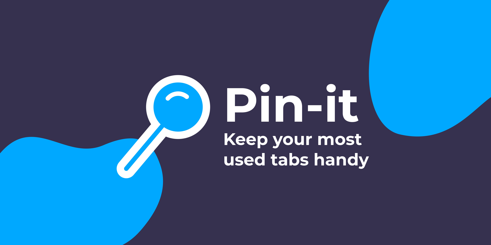

# Pin-It Chrome Extension

[Pin-It](https://chrome.google.com/webstore/detail/pin-it/iaebojjjijdaeinlldahkekclhdjgkme)
is a simple Chrome extension that makes it easy to keep a set of tabs pinned.

## Why?

Do you like having e-mail, slack, calendar, and other sites open while you work?

If so, this extension is for you! Never forget to open a website or forget
where the tab went.

Configure Pin-It with the sites you want it to open, and every time you click
on the extension icon, it'll set your pinned tabs to your sites.

## Installation & Usage

Learn more about how to install and use this extension at
[gaunt.dev/projects/pin-it/](https://www.gaunt.dev/projects/pin-it/).
